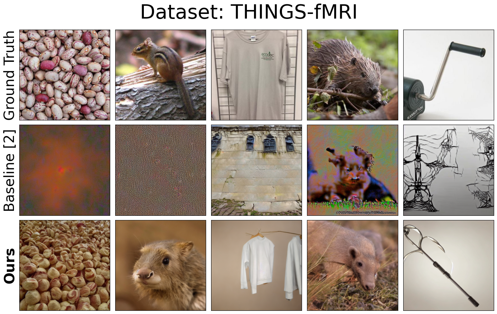

# Image Reconstruction from fMRI

*Fall 2023 CS292F (Machine Learning on Graphs) course project*

In this project, we introduced a new deep-learning framework to reconstruct images from **human brain fMRI data** using Latent Diffusion Models (LDM). 

Our contributions are:

1. We proposed four brain-to-image decoding neural network modules; 
2. We implemented a novel GCN-based module for brain decoding tasks;
2. We adapted our architecture to two distinct datasets (NSD and THINGS-fMRI) and established new benchmarks for future studies. 


**Figure 1.** Proposed framework overview, image adapted from [Takagi & Nishimoto, 2023](https://openaccess.thecvf.com/content/CVPR2023/papers/Takagi_High-Resolution_Image_Reconstruction_With_Latent_Diffusion_Models_From_Human_Brain_CVPR_2023_paper.pdf) and [Lu et al., 2023](https://dl.acm.org/doi/10.1145/3581783.3613832).

:link: For environment setup and required weights and datasets, please see: [Implementation Details Section](#implementation-details)

:bookmark_tabs: For further reading, please see: [final_report.pdf](/final_report.pdf)

# Introduction
Reconstructing images from brain activities could provide valuable insights into neural coding mechanisms. 

Recent works in brain-to-image tasks often relied on having linear projections from fMRI features to pre-trained latent spaces, which may not fully capture the brain's nonlinear neural coding, or lacked comprehensive comparisons across various nonlinear architectures.

To address these gaps:
- We explored nonlinear architectures (CNN, VAE, GCN) for brain-to-image decoding.
- We incorporated LDM (Stable Diffusion) to reconstruct high-fidelity images from neural activities.

# Methods
## Pipeline
Inspired by [Takagi & Nishimoto, 2023](https://openaccess.thecvf.com/content/CVPR2023/papers/Takagi_High-Resolution_Image_Reconstruction_With_Latent_Diffusion_Models_From_Human_Brain_CVPR_2023_paper.pdf) and the fact that lower visual cortex is more relevant to low-level image features such as edges and higher visua cortex is associated with high-level semantic information, our reconstruction pipeline consists of two stages:

Stage 1:
- Map *higher* visual cortex fMRI activities to CLIP latent text embeddings.
- Map *lower* visual cortex fMRI activities to VQ-VAE latent image embeddings.

Stage 2:
- Generate images using LDM (Stable Diffusion) conditioned on mapped latent text and image features

## Architectures
- fMRI-to-text module
    1. CNN-based: residual Conv1D layers followed by 3 fully connected layers (inspired by [Lin et al, 2022](https://proceedings.neurips.cc/paper_files/paper/2022/file/bee5125b773414d3d6eeb4334fbc5453-Paper-Conference.pdf))
- fMRI-to-image modules 
    1. CNN-based: Residual Conv1D layers followed by 3 fully connected layers
    2. VAE-based: Variational Autoencoder with two fully connected layers as the encoder and three FC-BN-LeakyReLU blocks as the decoder
    3. GCN-based: 
        - Two ChebConv layers with BatchNorm and ReLU
        - To construct fMRI graph representation from raw fMRI signals:
            - Neurons from visual cortex V1 and V2 were treated as two separate nodes, and V3 and V4 were conbined into another node.
            - Graph node's *features* were the corresponding ROI's normalized voxel activities.
            - Graph *edges* were computed by the funtional connectivity across nodes using Pearson's correlation coefficient.

## Datasets
- [The Natural Scenes Dataset (NSD)](https://naturalscenesdataset.org/)
- [THINGS-fMRI](https://openneuro.org/datasets/ds004192/versions/1.0.7)

# Results

Baseline: [Takagi & Nishimoto, 2023](https://openaccess.thecvf.com/content/CVPR2023/papers/Takagi_High-Resolution_Image_Reconstruction_With_Latent_Diffusion_Models_From_Human_Brain_CVPR_2023_paper.pdf)

## Stage 1: Feature Decoding
*Nonlinear* models significantly outperformed linear baselines in decoding fMRI to image and text latent spaces.


## Stage 2: Image Reconstruction
Our proposed *CNN-based fMRI-to-text* module and *GCN-based fMRI-to-image* module yielded best reconstruction results qualitatively and quantitatively in both NSD and THINGS-fMRI datasets.


Sample reconstructed images from NSD dataset:


Sample reconstructed images from THINGS-fMRI dataset:




# Implementation Details
## Environment Setup
Create and activate conda environment named ```ldm``` from ```environment_cs292.yml```
```sh
cd cs292f
conda env create -f environment_cs292.yml
conda activate ldm
```

Install Stable Diffusion v1.4 (under the diffusion_sd1/ directory), download checkpoint (sd-v1-4.ckpt), and place it under the ```codes/diffusion_sd1/stable-diffusion/models/ldm/stable-diffusion-v1/``` directory.

All reconstructed images are available: [Google Drive](https://drive.google.com/drive/folders/13K7H1X_cuCKwYBZGEG3xxEtBNYyuUJcM?usp=drive_link)

note: I hard-coded some file paths, please do 
```sh
grep -r '/hdd/yuchen'
```
and change file paths accordingly to make sure everything is stored in the intended location

## File Descriptions

```generate_files.ipynb```: generating fmri and image data files

```roi_image_encoder.ipynb```: mapping low-level fmri to image CLIP space using GCN

```roi_text_encoder.ipynb```: mapping high-level fmri to text CLIP space using GCN

```evaluation.ipynb```: evaluation


